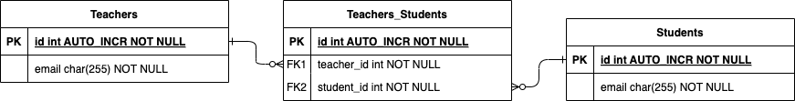
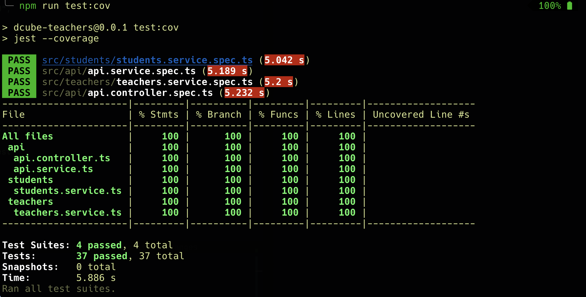

# GovTech Student Management for Teachers

A system where teachers can perform administrative functions for their students. Teachers and students are identified by their email addresses.

This is a submission for the [GovTech Student Management for Teachers](https://gist.github.com/d3hiring/4d1415d445033d316c36a56f0953f4ef).

## 💻 Table of Contents

- 🔗 [Deployments](#deployments)
- 🗄️ [Database Diagram](#database-diagram)
- 🗄️ [Project Structure](#project-structure)
- ⚙️ [Installation](#installation)
- 🚄 [Run the App](#run-the-app)
- 🧪 [Run Unit Tests](#run-unit-tests)
- 🧪 [Run E2E Tests](#run-e2e-tests)
- 🧱 [Technologies Used](#technologies-used)
- 📝 [Assumptions](#assumptions)

<h2 id="deployments">Deployments</h2>

### GCP
1. Database: CloudSQL
2. Service: CloudRun
3. Docker Registry: Artifact Registry

The project has a [github workflow](.github/workflows/deploy.yaml) to build a docker image and push it to Artifact Registry, following by a command which deploys changes to the CloudRun:
https://dcube-teachers-157732259470.asia-southeast1.run.app

<h2 id="database-diagram">🗄️ Database Diagram</h2>



<h2 id="project-structure">🗄️ Project Structure</h2>

```
├── Dockerfile                                # Dockerfile used to build production image and pushed to GCP Artifact Registry
├── Dockerfile.dev                            # Dockerfile dedicated for development environment only
├── README.md
├── docker-compose.yaml                       # Docker-compose for development environment only
├── e2e                                       # E2E directory, including dedicated docker-compose to start up e2e environment
│   ├── Dockerfile
│   ├── db.ts
│   ├── docker-compose.yaml
│   ├── jest.config.ts
│   ├── package-lock.json
│   ├── package.json
│   ├── specs
│   │   └── api.spec.ts                        # Test suite for route handlers of the api
│   └── tsconfig.json
├── migrations                                 # Migration directory
│   └── 1741936503670-Init.ts
├── nest-cli.json
├── package-lock.json
├── package.json
├── requests.http                              # Contains some sample requests
├── snapshots
│   ├── coverage.png
│   └── database.png
├── src
    ├── api
    │   ├── api.controller.spec.ts
    │   ├── api.controller.ts                   # Define route handlers for the api
    │   ├── api.module.ts
    │   ├── api.service.spec.ts
    │   ├── api.service.ts                      # Logic code under the route handlers
    │   └── dtos                                # DTOs for some requests in need
    │       ├── create-teacher.dto.ts
    │       ├── get-for-notification.dto.ts
    │       ├── index.ts
    │       ├── register.dto.ts
    │       └── suspend-student.dto.ts
    ├── app.module.ts
    ├── data-source.ts                          # Data configuration for environments
    ├── main.ts
    ├── mocks
    │   ├── data.mock.ts                        # Mock Data for UT
    │   └── repository.mock.ts                  # Mock Repository factory
    ├── students
    │   ├── student.entity.ts                   # Entity defines Student
    │   ├── students.module.ts                  # Module manages Services of Student
    │   ├── students.service.spec.ts            # Unit tests for students service
    │   └── students.service.ts                 # Service implements actual logic
    └── teachers
        ├── teacher.entity.ts                   # Entity defines Teacher
        ├── teachers.module.ts                  # Module manages Services of Teacher
        ├── teachers.service.spec.ts            # Unit tests for teachers service
        └── teachers.service.ts                 # Service implements actual logic
```

<h2 id="installation">⚙️ Installation</h2>
- Docker Desktop (Mac/Windows) / Docker Engine (Linux)
- docker compose

1. Clone the repository

   ```bash
   git clone git@github.com:trungnd3/dcube-teachers.git
   cd dcube-teachers
   ```

<h2 id="run-the-app">🚄 Run the App</h2>

This will start a development server on port 3000 by default.

1. Go to the .env directory file, rename env_sample.txt to .env and mysql_env_sample.txt to .mysql.env (You could change the variables inside to your liking, but it's not recommended since some variables need to be matched)

2. Run this command to start the server on development:

```bash
docker compose --build -d
```

Your API is now ready to be served at http://localhost:3000

<h2 id="run-unit-tests">🧪 Run Unit Tests</h2>

```bash
npm run test
```



<h2 id="run-e2e-tests">🧪 Run E2E Tests</h2>

1. Change directory to e2e sub-folder

2. Go to the .env directory here, rename env_sample.txt to .env and mysql_env_sample.txt to .mysql.env (You could change the variables inside to your liking, but it's not recommended since some variables need to be matched)

3. Run this command (still in e2e sub-folder)

```bash
docker compose --build -d
```

This command will start a MYSQL database service for e2e test, spin up the api with the image pulled from Google Artifact Registry (same with the ones are using for production), then run a test suite to test the endpoints.

4. Run this command to check log of the test suite

```bash
docker logs -f dcube-teachers-test-e2e
```


<h2 id="technologies-used">🧱 Technologies Used</h2>

- **Backend**: NestJs, Typescript, TypeORM
- **Database**: MySQL
- **Build tool**: Docker Compose
- **Testing tool**: Jest

<h2 id="assumptions">📝 Assumptions</h2>

- When teacher register students, if one ore more students doesn't exist, that student(s) will be created.
- Suspending student is to remove student from the teacher's registration list, a teacher should present in the request.
